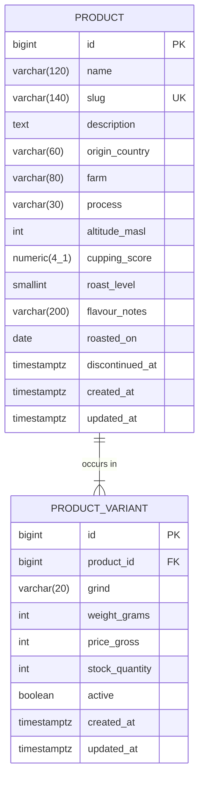

# Model danych — MorningCoffee

Opis bytów dziedzinowych, schemat bazy i uzasadnienie decyzji modelowych.

**Stan:** schemat obejmuje kawy i ich warianty. Koszyk, klienci i zamówienia
są opisane w modelu pojęciowym, ale ich tabele powstaną w kolejnych etapach.

---

## Model pojęciowy

Byty wynikają z historii użytkownika opisanych w `user-stories.md`.

| Byt | Opis |
|---|---|
| **Kawa** | Konkretne ziarno od konkretnego producenta. Ma pochodzenie, obróbkę, wysokość uprawy, ocenę i nuty smakowe. Sama w sobie nie jest przedmiotem zakupu. |
| **Wariant** | Kawa w konkretnej postaci: stopień zmielenia i gramatura. Jedyny byt, który da się kupić. Ma własną cenę i własny stan magazynowy. |
| **Klient** | Osoba z kontem w sklepie. |
| **Koszyk** | Zbiór tego, co klient zamierza kupić. Zmienny, bez skutków prawnych. Należy do klienta albo do niezalogowanego gościa. |
| **Pozycja koszyka** | Wskazanie wariantu wraz z ilością. |
| **Zamówienie** | Moment, w którym zamiar staje się zobowiązaniem. Ma numer, status, adres dostawy i kwotę. |
| **Pozycja zamówienia** | Zapis tego, co i za ile zostało kupione. |

### Związki

- Jedna kawa ma jeden lub więcej wariantów. Wariant należy do dokładnie jednej kawy.
- Jeden klient ma jeden koszyk. Koszyk może również należeć do niezalogowanego gościa.
- Koszyk zawiera wiele pozycji, każda wskazuje na jeden wariant.
- Jeden klient składa wiele zamówień. Zamówienie należy do jednego klienta.
- Zamówienie zawiera jedną lub więcej pozycji.

---

## Schemat — kawy i warianty

---

## Decyzje modelowe

### Wariant jest przedmiotem zakupu

Cena i stan magazynowy należą do wariantu, nie do kawy, ponieważ kupuje się
konkretne opakowanie o konkretnym zmieleniu. Cechy ziarna — pochodzenie,
obróbka, wysokość, ocena — należą do kawy, bo nie zmieniają się wraz
z gramaturą. Umieszczenie ich na wariancie powielałoby te same wartości
w każdej kombinacji zmielenia i wagi, co prowadzi do rozbieżności
przy aktualizacji.

### Kwoty w groszach

`price_gross` przechowuje grosze: wartość `5490` oznacza 54,90 zł.
Uzasadnienie i konsekwencje opisuje ADR-004.

### Cena kawy na liście katalogu

Kawa nie ma własnej ceny — cena należy do wariantu. Na liście katalogu
prezentowana jest cena najniższa spośród aktywnych wariantów. Ta sama
wartość służy do sortowania listy po cenie.

Wartość jest wyliczana z tabeli wariantów, nie przechowywana. To samo
dotyczy dostępności kawy, która oznacza, że co najmniej jeden wariant
ma dodatni stan magazynowy.

Konsekwencja: zapytanie o listę kaw musi pobierać te wartości jednym
zapytaniem z agregacją. Wyliczanie ich osobno dla każdej pozycji
prowadziłoby do wielokrotnego odpytywania bazy przy jednym żądaniu.

### Dwa niezależne poziomy dostępności

`PRODUCT.discontinued_at` oznacza wycofanie kawy z oferty w całości.
`PRODUCT_VARIANT.active` oznacza rezygnację z konkretnego opakowania,
przy zachowaniu pozostałych. Są to odrębne decyzje handlowe, więc mają
odrębne pola.

### Wycofanie zamiast usunięcia

Kawy nie usuwa się z bazy. Wycofana pozostaje widoczna w złożonych wcześniej
zamówieniach — usunięcie rozerwałoby zapisy historyczne. Zapytania katalogu
pomijają rekordy z ustawionym `discontinued_at`.

Wynika to wprost z kryterium akceptacji historii 5.1.

### Znacznik czasu zamiast flagi logicznej

`discontinued_at` przechowuje moment wycofania, a wartość pusta oznacza
kawę dostępną. Zajmuje tyle samo miejsca co wartość logiczna,
a niesie dodatkową informację.

### Data wypału zamiast liczby dni

Przechowywana jest `roasted_on`, a liczba dni od wypału wyliczana przy
odczycie. Wartość wyliczalna, która zmienia się z upływem czasu, nie może
być przechowywana — wymagałaby codziennej aktualizacji wszystkich rekordów.

### Znaczniki czasu ze strefą

Wszystkie kolumny czasowe używają `timestamptz`. Typ bez strefy jest
niejednoznaczny, gdy serwer i klienci znajdują się w różnych strefach
lub gdy następuje zmiana czasu. `roasted_on` jest wyjątkiem — to data
dzienna, godzina nie ma tu znaczenia biznesowego.

### Ocena jako typ dziesiętny

`cupping_score` używa `numeric(4,1)`, mimo że kwoty przechowujemy jako
liczby całkowite. Na ocenie nie są wykonywane działania arytmetyczne —
jest przechowywana i wyświetlana, więc ryzyko błędów zaokrągleń
nie występuje.

### Stopień wypału jako liczba

`roast_level` przyjmuje wartości od 1 do 3. Typ wyliczeniowy PostgreSQL
byłby czytelniejszy, ale jego rozszerzenie wymaga migracji blokującej
tabelę. Liczba z warunkiem poprawności pozostaje elastyczniejsza.

### Spójność pilnowana przez bazę

Unikalność `slug` jest ograniczeniem bazy danych, nie sprawdzeniem
w kodzie. Sprawdzenie w aplikacji nie jest wystarczające, ponieważ między
odczytem a zapisem inny wątek może wstawić tę samą wartość.

Para `(product_id, grind, weight_grams)` również jest unikalna. Bez tego
ograniczenia możliwe byłoby utworzenie dwóch identycznych wariantów
tej samej kawy, różniących się wyłącznie ceną.

---

## Świadomie pominięte

Zdjęcia produktów, płatności jako osobny byt, dostawcy, kupony rabatowe,
recenzje, subskrypcje.

Żaden z tych bytów nie występuje w historiach użytkownika dla obecnego
zakresu. Byt nieobecny w wymaganiach nie trafia do modelu.
